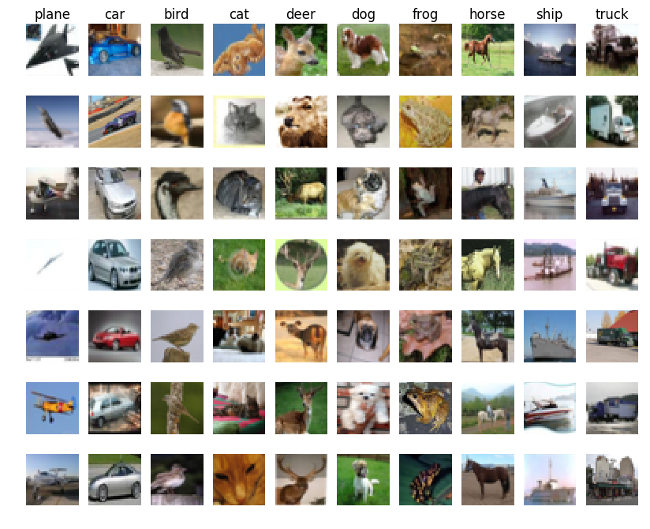

# Вступление

Данный проект посвящён выстраиванию процессов автоматизации (MLOPS) вокруг известной задачи компьютерного зрения CIFAR-10.



CIFAR-10 - это задача классификации изображений, в которой требуется определить, к какому классу из десяти относится каждое изображение. Набор данных состоит из 60 000 цветных изображений размером 32x32 пикселей, разделённых на 10 классов: самолёты, автомобили, птицы, кошки, олени, собаки, лягушки, лошади, корабли и грузовики. Задача CIFAR-10 является стандартной задачей в области компьютерного зрения и часто используется в качестве бенчмарка для тестирования алгоритмов обучения с учителем.

# Структура проекта:
Ниже приведена структура проекта c пояснениями.
```python
❯ tree - a
. # Repo root
├── mlops # Project root
│   ├── config.py
│   ├── infer.py // infern
│   ├── model.py // neural network
│   ├── trainer.py // training
│   ├── prepare_dataset.py
│   │
│   ├── models # Saving models after training
│   │    └── .gitignore
│   │
│   ├── outputs # Training logs, etc.
│   │    └── .gitignore
│   │
│   ├── lightning_logs # Training logs
│   │    └── .gitignore
│   │
│   └── results # Where to save results
│        └── .gitignore
│
├── configs # Configs for training
│   ├── config_gpu_2.yaml
│   ├── config_gpu_1.yaml
│   └── config.yaml
│
├── data # Dataset
│   ├── cifar-10-batches-py.dvc
│   └── .gitignore
│
├── .github # CI
│   └── workflows
│       └── pre-commit.yaml
│
├── .dvc # dvc
│   └── ...
│
├── templates
│    └── Cifar-10.png
│
├── Makefile
│
├── .pre-commit-config.yaml
│
├── poetry.lock
├── pyproject.toml
│
├── .dvcignore
├── .gitignore
│
└── README.md
```

# Соответствие проекта техническому заданию

0. Проект решает задачу машинного обучения (CIFAR-10). Для обучения используется скрипт ./mlops/infern.py, а для предсказания - ./mlops/infern.py.
Были использованы следующие инструменты разработки:
1. Poetry. Зависимости представлены в ./pyproject.toml.
2. Pre-commit. Использованы black, isort, flake8 хуки (./.pre-commit-config.yaml).
3. DVC. Хранение датасета производится при помощи dvc (./dvc/) на удаленном диске google-drive. Скачивание данных с помощью dvc встроено в python3 код.
4. Hydra. Основные гиперпараметры обучения внесены в yaml конфиги в ./configs/
5. Добавлено логирование основных метрик и функций потерь. Сервер mlflow поднимается на порту 128.0.1.1:8080.

*Дополнительно также было реализовано:*

6. Для автоматизации сборки и исполнения добавлен ./Makefile.
7. Добавлен github workflows (CI) [./.github].

# Установка и запуск

### Предварительные требования:

Выполнить следующую команду:
```bash
cat /etc/os-release
```
Результат должен быть следующим:
```plaintext
...
ID_LIKE="ubuntu debian"
или
ID_LIKE="ubuntu"
или
ID_LIKE="debian"
...
```
В случае другого дистрибутива или ОС работоспособность не гарантирована!


Выполнить следующую команду:
```bash
python3 -V
```
Результат должен быть следующим:
```
Python 3.11.0
```
В случае другой версии работоспособность не гарантирована. Необходимую версию ставить, например, при помощи [pyenv](https://github.com/pyenv/pyenv). Ниже в рекомендованном способе установки данный способ установки автоматизирован.


Скачайте репозиторий и перейдите в корень проекта:
```bash
git clone git@github.com:ovctech/mlops.git -b master && cd mlops
```


### Рекомендуется:

1. Установите утилиту make:
```bash
sudo apt update
sudo apt install make
```

2. Установите pyenv и создайте чистое окружение с необходимое версией интерпретатора python3, а также необходимыми зависимостями. При этом будет в другом терминале будет открыта платформа Mlflow:
```bash
make prepare
```
Примечание: Вы должны находит в корне репозитория.

3. Запустите процесс обучения и предсказания:
```bash
make
```

### Ручной режим:
0. Создайте чистое виртуальной окружение с интепретатором python3 3.11.0 версии.

1. Перейдите в корень проекта
```bash
cd mlops/
```
2. Запустите процесс обучения:
```bash
python3 trainer.py
```
3. Получите предсказание, выполнив:
```bash
python3 infern.py
```

4. Предсказания в формате .csv будет сохранены в ./mlops/results/ .
